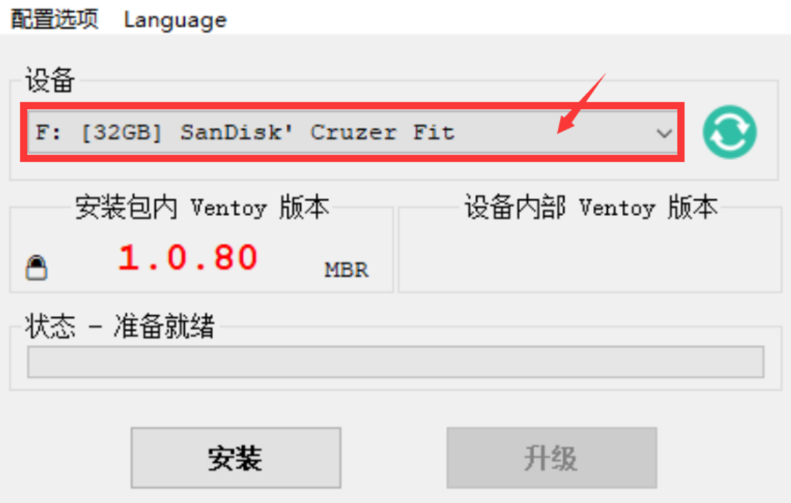
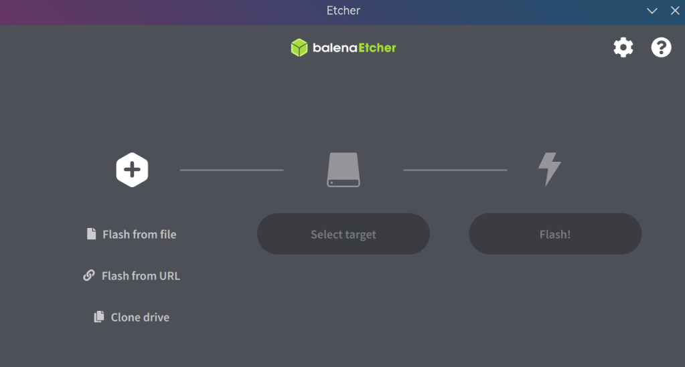
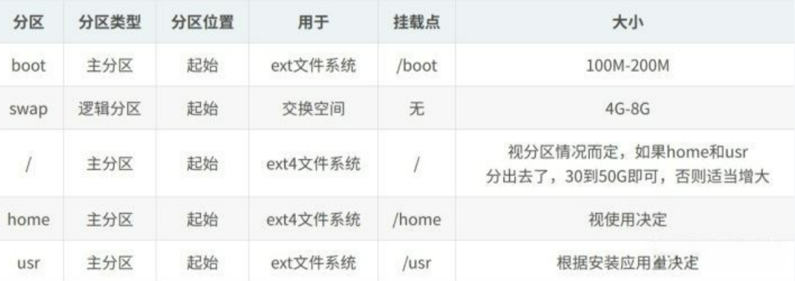

### Ventoy

> 优：单盘可制作多镜像，同时支持 x86 Legacy BIOS、IA32 UEFI、x86_64 UEFI、ARM64 UEFI 和 MIPS64EL UEFI 模式。此外，U盘空余部分在分盘后可正常使用
>
> (个人最喜欢的制作工具)

**下载地址：**[Github](https://github.com/ventoy/Ventoy/releases)

**使用：**选择设备，安装后将镜像文件拷贝至U盘。

### Balena Ethcer

> 优：操作简单便捷，速度快
>
> 缺：单盘做单系统，剩余空间不可用。恢复u盘需要重建分区表

**下载地址：**[etcher.balena](https://etcher.balena.io/)

**使用：**

## 分盘策略

转自：[知乎](https://zhuanlan.zhihu.com/p/101307629)

------

Windows支持在安装后对磁盘进行分区设置D盘、E盘等，而Linux则是你在安装的时候可以把某些重要文件夹（称为**挂载点**）分配到不同的磁盘分区。一般情况下，只有`root`是必须要设置的，其它的默认挂载到root分区下。但是，为了方便管理，很多人会独立设置`boot`，`home`, `usr`, `swap`，下面分别说明这几个分区的作用

1. `boot`，启动分区。很多地方建议设置100M到200M，但是有这种说法提倡不要划分boot分区：
   仅对于不知道怎么分区的用户而言，高级用户应该明白自己需要什么，例如确定自己使用的BIOS可能无法读取100GB后的位置或是要使用LVM等。 linux社区的一个问题是，很多老旧的资料还在网上传来传去。其中一些真的需要更新了，例如给/boot专门分一个100MB的分区这种做法。 曾经给/boot一个很小的分区是有十分充足的理由的，因为在二十几年前，BIOS只能认一个1024柱面的硬盘，如果启动文件放在0-1023（从0开始数，共1024个柱面）之外，BIOS就无法读取启动所需的文件，从而无法启动。为了兼容这种BIOS，就需要在磁盘前端分出一个小分区专门来存储启动文件。 但是现在，应该是找不到那么古老的主板了，即使能找到，也无法安装现在的linux了。 100MB的boot分区，有什么害处呢？ 太小了，放不下现在启动所需的文件了。现在的linux，留下两个内核是很正常的，如果新内核有什么问题，还可以用老内核。这台机器上现在有两个版本的linux内核（3.13.0-85 和 4.4.0.21），一共多大呢？ 代码: ls -al –block-size=M /boot total 98M 看上去两个内核100MB勉强够用，但是现在的启动文件是越来越大的，例如3.13的initrd是29M，但4.4的initrd有35M，下一次升级内核，100MB就不够用了。 另外在Debian系的Linux发行版上，还有另一个问题，老旧的内核不会被自动清除。上次手动清理冗余内核的时候，/boot已经达到了700+MB。/boot分区满了，内核就无法安装，引发问题。 所以，不要划分/boot分区。 另外，使用gpt的硬盘那个EFI system partition不是boot分区，不要搞混了。
2. `home`: 用户目录。每个用户会生成一个文件夹，存放用户文件（Windows也有类似）。建议设置独立分区，分区的大小取决于剩下的空间。
3. `swap`: 交换空间。作用类似虚拟内存。建议设置独立分区，大小跟系统内存一样即可，内存16G以上可以考虑不用。详细查看[Ubuntu官方建议](https://link.zhihu.com/?target=https%3A//help.ubuntu.com/community/SwapFaq)。
4. `usr`：应用分区。很多安装的应用都会放在该分区，如果将在Ubuntu上安装多种应用程序，可以考虑独立分区，大小看程序数量，100G以内吧。
