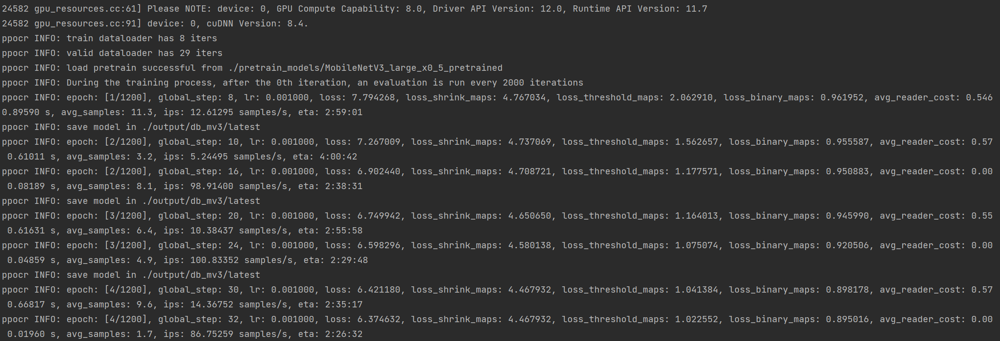

::GitHub{repo="LINXIAXING/PaddleOCR"}

Repository forked from [PaddlePaddle/PaddleOCR](https://github.com/PaddlePaddle/PaddleOCR)

---


## Document ##

| Description      | URL                                                          |
| ---------------- | ------------------------------------------------------------ |
| `环境搭建`       | https://github.com/LINXIAXING/PaddleOCR/blob/main/doc/doc_ch/environment.md |
| `模型集合`       | https://github.com/LINXIAXING/PaddleOCR/blob/main/doc/doc_ch/models_list.md |
| `OCR数据集`      | https://github.com/LINXIAXING/PaddleOCR/blob/main/doc/doc_ch/dataset/ocr_datasets.md |
| `表格数据集`     | https://github.com/LINXIAXING/PaddleOCR/blob/main/doc/doc_ch/dataset/table_datasets.md |
| `版面分析数据集` | https://github.com/LINXIAXING/PaddleOCR/blob/main/doc/doc_ch/dataset/layout_datasets.md |
| `数据标注`       | https://github.com/LINXIAXING/PaddleOCR/blob/main/PPOCRLabel/README.md |
| `PP-Structure`   | https://github.com/LINXIAXING/PaddleOCR/blob/main/ppstructure/docs/quickstart.md |


## 环境搭建 ##

```shell
python3 -m pip install paddlepaddle-gpu -i https://mirror.baidu.com/pypi/simple
git clone https://github.com/PaddlePaddle/PaddleOCR.git
cd ./PaddleOCR
python install -r ./requirements.txt
```

或者通过`docker pull paddleocr:laest`获取最新的[PaddleOCR镜像](https://hub.docker.com/r/paddlecloud/paddleocr)。


## 数据集准备 ##

使用公开的数据集或通过PaddleOCR提供的打标工具制作数据集：

```
pip install -r ./PPOCRLabel/requirements.txt
python ./PPOCRLabel/PPOCRLabel.py --lang=ch
```

### Dataset for OCR ###

数据集树状目录：

```
/dataset
├─det
│  ├─test_imgs
│  ├─train_imgs
│  ├─filestate.txt
│  ├─test_label.txt
│  ├─train_label.txt
│  └─Cache.cach
└─rec
    ├─crop_img_test
    ├─crop_img_train
    ├─rec_gt_test.txt
    └─rec_gt_train.txt
```

det数据label格式：

```
<file_path> [{"transcription": "", "point": [[0, 0], [0, 1], [1, 0], [1, 1]], "difficult": false}, ]
```

rec数据label格式：

```
<file_path> <ground_truth>
```

:::tip
数据不支持中文，且label中file_path中取相对位置，这意味着你或许需要对数据进行再处理。
:::

### Dataset for PP-Structure ###

PASS


## 训练配置 ##

配置文件路径：`/PaddleOCR/configs`

:::note
OCR实测**DB**模型`/PaddleOCR/configs/det/det_mv3_db.yml`+**CRNN**模型`/PaddleOCR/configs/rec/rec_r34_vd_none_bilstm_ctc.yml`模型效果较佳。

Table OCR模型使用**SLANet**模型`/PaddleOCR/configs/table/SLANet_ch.yml`效果较佳。

:::


## 模型训练 ##

单机单卡训练：

```
python tools/train.py -c <config.yml>
```

单机多卡训练：

```
python -m paddle.distributed.launch --gpus '0,1,2,3' tools/train.py \ 
-c <config.yml>
```

多机多卡训练：

```
python -m paddle.distributed.launch --ips="xx.xx.xx.xx,xx.xx.xx.xx" \
--gpus '0,1,2,3' tools/train.py -c <config.yml>
```




## 模型评估 ##

```
python tools/eval.py -c <config.yml>  -o Global.checkpoints="{path/to/weights}/best_accuracy"
```

评估同样可以多机多卡，参考训练命令。

[^Global.pretrained_model]: 待测试权重


## 模型部署使用 ##

**导出模型：**

```
python tools/export_model.py -c <config.yml> -o \
Global.pretrained_model="./output/db_mv3/best_accuracy" \
Global.save_inference_dir="./inference/det_db_inference/"
```

**替换模型权重：**

默认的权重加载/下载路径在`～/.paddleocr/`下，将导出的模型替换到对应文件夹下再进行测试。

```
img_path = './test.jpg'
ocr = PaddleOCR(use_angle_cls=True, use_gpu=False,
lang="ch")  # need to run only once to download and load model into memory
result = ocr.ocr(img_path, det=True, cls=False, rec=True)
# 预测结果包含识别BOX的位置信息，文字以及置信度
# [[[x, y]]*4, (word, confidence)]
for line in result[0]:
	print(line)

image = Image.open(img_path).convert('RGB')
boxes = [line[0] for line in result[0]]
txts = [line[1][0] for line in result[0]]
scores = [line[1][1] for line in result[0]]
im_show = draw_ocr(image, boxes, txts, scores)
im_show = Image.fromarray(im_show)
im_show.save('./result.jpg')
```
